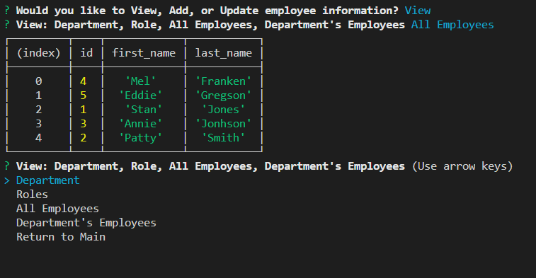

 # Employee Tracking Database
  ---
  * [GitHub Repository](https://github.com/MVPeter/EmployeeTracking-DataBase)

  
      
  ## Table of Contents
    - Discription
    - Installation
    - Usage
    - Contributions
    - Liscense
    - Questions

  ---
  
  ## Discription

  This project helps create and manage a database of employees.  You can create departments, role, and asign employees to them.  You can update and delete employees, departments, and their roles.

  

  ---
  
  ## Installation

  This project uses: Inquirer, MYSQL, and dotenv.  They can be installed using 'npm i'

  ---
  
  ### Usage

    * The applications runs at a prompt using 'node index.js'

  ---
  
  ### Tests

    * none.

  
  ### Contributions

    * 

  ---
  
  ### License

    * This project is covered by the following license(s): None
    

  ---
  
  ### Questions
  - GitHub Profile: [GitHub Profile](https://github.com/MVPeter)
  - For further questions please contact me at email:  MVPetersen1@gmail.com

  